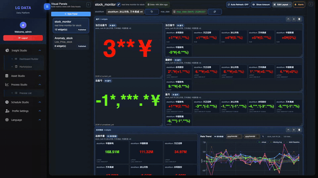

# 📈 自动盯盘与盈亏推送助手 (Stock Profit Monitor)

作为一个打工人，每天盯着炒股软件看太心累了，一不小心还会错过止盈止损点。
这是一个基于数据流编排的**轻量级自动化盯盘工具**。它会自动抓取你的持仓数据、计算当日盈亏，并在触发你设定的阈值时，自动通过 Webhook 推送到你的微信/飞书/钉钉。

## ✨ 核心特性
- **📊 极简看板**：直观展示当日盈亏、累计盈亏和个股涨跌幅。
- **🚨 自动化报警**：自定义阈值（如跌幅超过 5%），自动触发 Webhook 推送。
- **☁️ 零代码运维**：无需自己购买服务器挂脚本，无需处理复杂的定时任务。
- **⚡ 一键部署**：基于 LG-Data 引擎，开箱即用。

## 🚀 快速开始 (1 分钟极速体验)

我们提供了一键克隆运行的云端免部署方案，这是最快跑起来的方式：

1. 点击上方按钮，进入 [LG-Data 控制台](https://lg-data.cc/market)。
2. 在 Market 中找到 `Stock Monitor` 模板。
3. 点击 **“一键 Fork”**。
4. 填入你的自选股代码和 Webhook 地址，点击运行，你的专属盯盘机器人就上线了！

## 🛠️ 定制与二次开发
如果你需要接入更多的通知渠道或者修改计算逻辑，本模板完全支持在画布中拖拽修改数据处理节点（Processor）。